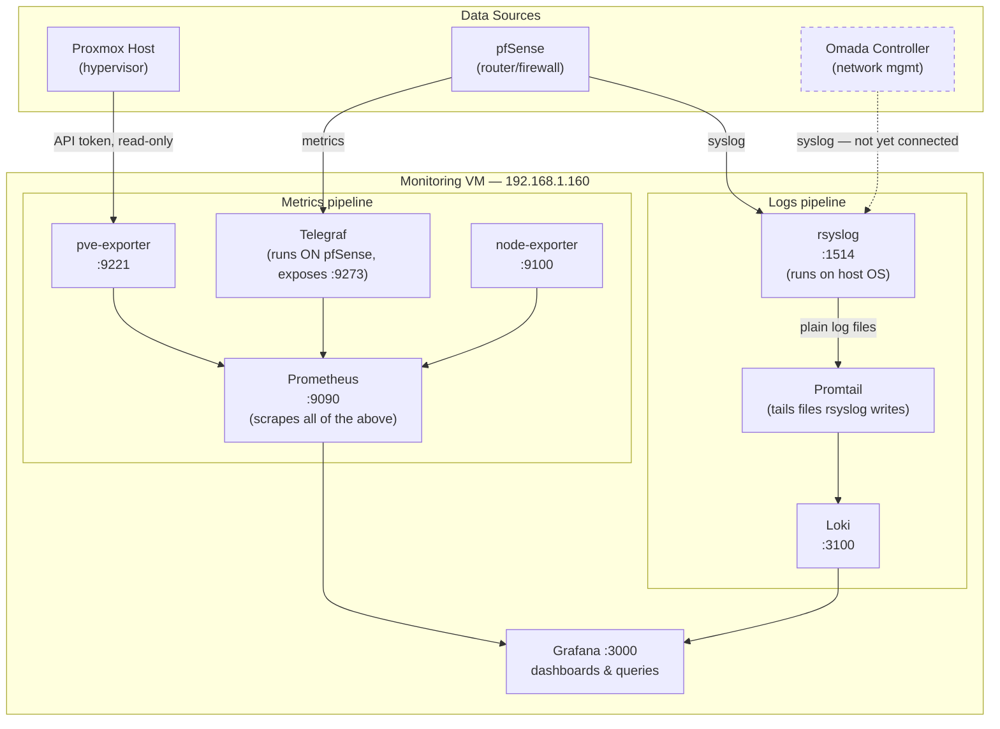

# Homelab Monitoring Stack

A centralized logging and metrics platform for a self-hosted homelab, built on **Grafana, Loki, and Prometheus**, running as Docker containers on a dedicated Ubuntu VM inside Proxmox. It pulls metrics and logs from three systems that previously had no unified visibility: **Proxmox** (the hypervisor), **pfSense** (the router/firewall), and **Omada Controller** (network/Wi-Fi management).

## Why this project exists

Before this, checking on the homelab meant logging into three separate web UIs with no history, no alerting, and no way to correlate events across systems (e.g. "did the firewall do something right when Proxmox's CPU spiked?"). This project consolidates all of that into one place, with history retained and a queryable interface.

It was also a deliberate way to get hands-on with a stack (Prometheus + Grafana + Loki) that's an industry-standard observability toolchain, not just a homelab curiosity — the same core pattern (metrics via Prometheus, logs via Loki, visualized in Grafana) shows up at companies running Kubernetes, cloud infrastructure, or any distributed system at scale.

## Architecture



**How to read this:** metrics and logs are two entirely separate pipelines that happen to converge in the same Grafana UI. Metrics are numbers over time (CPU %, memory, uptime) pulled by Prometheus on a schedule. Logs are text events (firewall denied a connection, a service restarted) pushed to Loki as they happen. They use different tools because they're fundamentally different data shapes — this is the standard split in modern observability, not something specific to this project.

## Key design decisions (the "why" behind each choice)

### Why Grafana + Loki + Prometheus, and not the ELK stack?
Both are legitimate choices. ELK (Elasticsearch/Logstash/Kibana) is powerful but heavy — Elasticsearch alone typically wants multiple GB of RAM just to idle comfortably. For a homelab VM, the Grafana stack (nicknamed "PLG") is dramatically lighter: Loki has no JVM and indexes only metadata rather than full text, so it's cheap to run. Given the goal was "useful monitoring on modest hardware," PLG was the better fit.

### Why is Telegraf involved for pfSense, not node_exporter?
`node_exporter` is Linux-only. pfSense runs on FreeBSD, so node_exporter isn't an option there at all. Telegraf is cross-platform, has an official pfSense package, and can expose metrics in Prometheus's format via its `outputs.prometheus_client` plugin — so it fills the same role node_exporter plays on the Linux boxes.

### Why does a whole extra service (rsyslog) sit in front of Promtail for logs?
This was the trickiest problem in the whole build, and worth explaining because it's a good example of debugging past an assumption. Promtail ships with a built-in syslog receiver, so the first attempt was to point pfSense straight at it. That failed with a parsing error: `expecting a version value in the range 1-999`.

The root cause: Promtail's receiver only understands **RFC5424** syslog (a newer, structured format with a version number). pfSense — like most consumer and enterprise network gear — sends the older **RFC3164** ("BSD syslog") format by default, which has no version field at all. Even switching pfSense's own syslog setting to "RFC5424 mode" didn't fully resolve it, since pfSense's implementation isn't strict enough for Promtail's parser.

The fix: **rsyslog**, a mature and far more permissive syslog daemon (already installed by default on Ubuntu Server), sits in front and accepts either format without complaint. Rather than trying to forward or reformat the messages, it just writes them to plain text log files — one folder per source hostname. Promtail then reads those exactly like it reads any other log file on disk, which sidesteps the syslog-parsing problem entirely rather than solving it head-on.

One follow-up bug from this: the first version of the rsyslog rule was a blanket `*.* → write to file`, which — because rsyslog processes local system messages through the same default pipeline — ended up also capturing the VM's own local logs (Docker, kernel, systemd) alongside the actual remote device logs. The fix was binding the network-only inputs (`imudp`/`imtcp`) to their own dedicated **ruleset**, so local messages never enter that code path at all. This is a good example of a fix that "worked" on the first pass but wasn't actually correct until tested more carefully.

### Why a dedicated, scoped API token for Proxmox instead of using root?
The Proxmox exporter needs read access to cluster/VM stats, and nothing else. Rather than handing it the root account (which could do anything, including destroy VMs), it's given its own user (`pve-exporter@pve`) with a token scoped to the `PVEAuditor` role — read-only by design. If that token ever leaked, the blast radius is "someone can view stats," not "someone can delete every VM." This is standard least-privilege practice, just applied at homelab scale.

### Why are some files excluded from git?
`.env` (Grafana admin credentials) and `pve-exporter.yml` (a live Proxmox API token) are both real secrets. Committing them to a repo — even a private one — means they live in git history forever, readable by anyone with repo access, indefinitely, even if later "removed." Both are gitignored, with `.example`/template versions committed instead so the *structure* is documented without the *secrets* being exposed.

### Why pin the monitoring VM's IP outside the DHCP pool?
The DHCP pool (`.10–.150`) is for anything that just needs *an* address — laptops, phones, guest devices. Infrastructure that other configs depend on (this VM's IP is hardcoded into Prometheus's scrape targets, for instance) needs to never silently change. Reserving it via a DHCP static mapping in pfSense, at an address outside the dynamic pool, keeps "this is infrastructure" visually obvious to anyone looking at the DHCP lease table later — including future me.

## Data flow by source

| Source | What's collected | How it gets there |
|---|---|---|
| Proxmox | CPU, memory, disk, VM/node status | `pve-exporter` polls the Proxmox API on a schedule using a read-only token; Prometheus scrapes `pve-exporter` |
| pfSense | CPU, memory, interface throughput, states | Telegraf (running on pfSense) exposes a Prometheus-format endpoint; Prometheus scrapes it directly |
| pfSense | Firewall events, DHCP leases, system events | pfSense's native remote syslog → rsyslog (on the monitoring VM) → log file → Promtail → Loki |
| Omada Controller | *(planned, not yet connected)* | Will use the same rsyslog relay path as pfSense once configured |
| Monitoring VM itself | CPU, memory, disk | `node-exporter` on the same VM, scraped by Prometheus |

## Repository structure

```
monitoring-stack/
├── docker-compose.yml
├── .env                       # secrets — gitignored, not in this repo
├── .env.example                # template — commit this instead
├── .gitignore
├── README.md
├── host-config/
│   └── 10-remote.conf          # rsyslog config — lives on the VM's host OS, not in Docker
└── config/
    ├── loki/
    │   └── loki-config.yml
    ├── promtail/
    │   └── promtail-config.yml
    ├── prometheus/
    │   ├── prometheus.yml
    │   └── pve-exporter.yml    # contains a real API token — gitignored
    └── grafana/
        └── provisioning/
            └── datasources/
                └── datasources.yml
```

## Setup

### Prerequisites
- Ubuntu VM with Docker Engine + the Compose plugin
- Network reachability to Proxmox (`:8006`), pfSense, and Omada Controller
- rsyslog installed (default on Ubuntu Server)

### 1. Secrets
```bash
cp .env.example .env
nano .env   # GRAFANA_ADMIN_USER / GRAFANA_ADMIN_PASSWORD
```
Fill in a real token in `config/prometheus/pve-exporter.yml` (see below for how to generate one).

### 2. Proxmox — create a scoped token
1. **Datacenter → Permissions → Users → Add** — username `pve-exporter`, realm **Proxmox VE authentication server** (produces `pve-exporter@pve`)
2. **Datacenter → Permissions → API Tokens → Add** — user `pve-exporter@pve`, token ID `monitoring`, **uncheck Privilege Separation**. Copy the secret shown (displayed once only).
3. **Datacenter → Permissions → Permissions → Add → User Permission** — path `/`, user `pve-exporter@pve`, role `PVEAuditor`
4. Paste the token into `config/prometheus/pve-exporter.yml`, and set your real Proxmox IP in `config/prometheus/prometheus.yml`.

### 3. pfSense — metrics
Install the Telegraf package, then in its config add:
```toml
[[outputs.prometheus_client]]
  listen = ":9273"
```
Set pfSense's IP in the `pfsense` job in `prometheus.yml`.

### 4. pfSense — logs
**Status → System Logs → Settings → Remote Logging** → point at `<monitoring-vm-ip>:1514`.

### 5. rsyslog relay (on the VM's host OS, not Docker)
```bash
sudo cp host-config/10-remote.conf /etc/rsyslog.d/10-remote.conf
sudo systemctl restart rsyslog
```

### 6. Launch
```bash
docker compose up -d
docker compose ps
```

### 7. Verify
- Grafana: `http://<vm-ip>:3000` — Prometheus and Loki should already be listed under Connections → Data sources
- Prometheus targets: `http://<vm-ip>:9090/targets` — all jobs `UP`
- Loki (Grafana Explore): query `{job="remote_syslog"}` for pfSense log lines

## Debugging log — problems hit and how they were diagnosed

Keeping this because the debugging process is arguably more demonstrative of understanding the stack than the end result.

- **MongoDB (an earlier, separate part of the homelab) crashed with `signal=ILL`** inside a Proxmox VM. Traced to the VM's virtual CPU type (`kvm64`, Proxmox's default) not exposing AVX instructions that MongoDB 5+ requires. Fixed by setting the VM's CPU type to `host` in Proxmox.
- **Loki crash-looped on startup** with `compactor.delete-request-store should be configured when retention is enabled`. Loki 3.x tightened validation — added the required `delete_request_store: filesystem` line.
- **pve-exporter returned 401 Unauthorized** repeatedly, across several attempted fixes. Diagnosed by testing the token directly against the Proxmox API with `curl` and `PVEAPIToken=`, bypassing the exporter entirely — this isolated whether the problem was the token itself or the exporter's config parsing. Root cause ended up being a token that needed regenerating, plus an earlier mistake concatenating `user@realm!tokenname` into a single field instead of two separate config keys.
- **Promtail showed a scrape job as "0/0 ready"** despite the target file existing with real content. Diagnosed by checking file permissions directly (`ls -la`) — the file was `640`, owned by a user/group the Promtail container's process couldn't read. Fixed with `$FileCreateMode 0644` in rsyslog's config.
- **pfSense logs were arriving, but so was the VM's own local log noise, mixed into the same stream.** Traced to a too-broad rsyslog rule matching all messages regardless of source. Fixed by binding the network listeners to a dedicated `ruleset`, isolating them from local message processing.

## Roadmap / not yet done

- Wire up Omada Controller's syslog output (same rsyslog relay, no new infrastructure needed)
- Build actual Grafana dashboards — data sources are connected, but no custom dashboards exist yet
- Investigate why pfSense log lines currently appear to arrive duplicated in Loki
- A reverse proxy for friendly hostnames without needing to remember ports (e.g. `grafana.home.lab` instead of `192.168.1.160:3000`) — deliberately scoped as a *separate*, later project from any future internet-facing reverse proxy for self-hosted game servers, since the security requirements for internal-only vs. internet-exposed traffic are meaningfully different.
